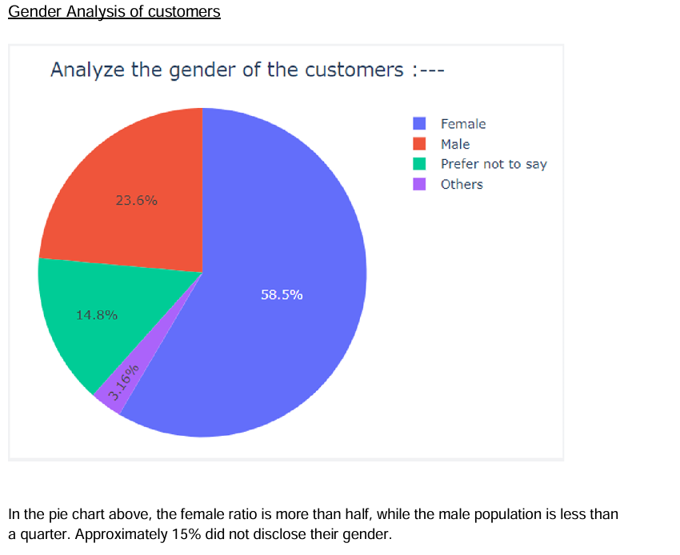
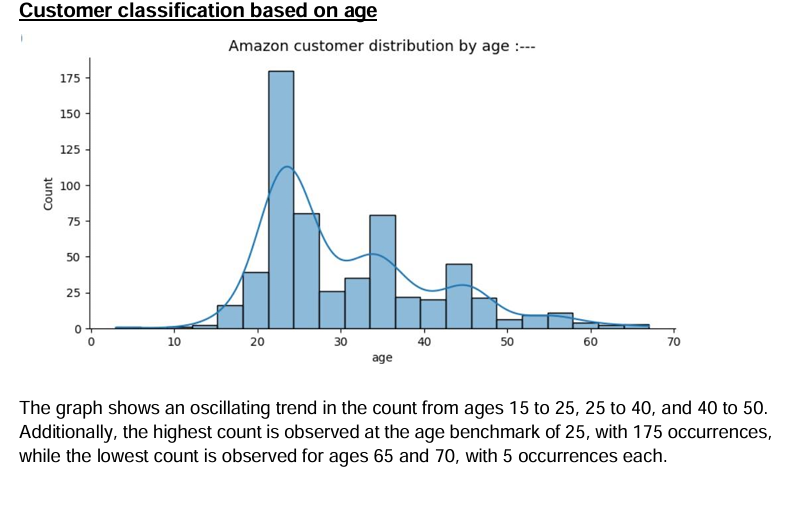
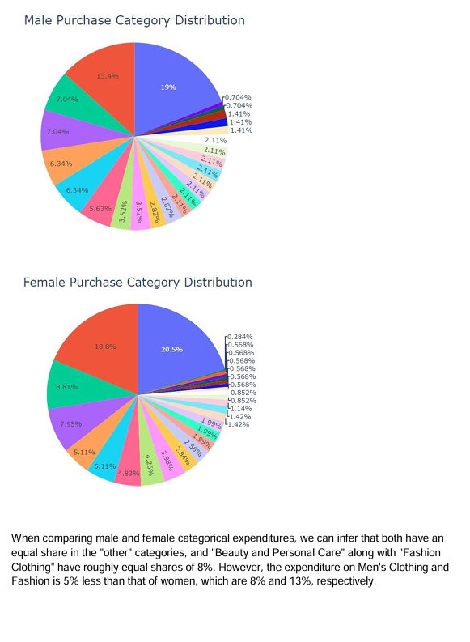
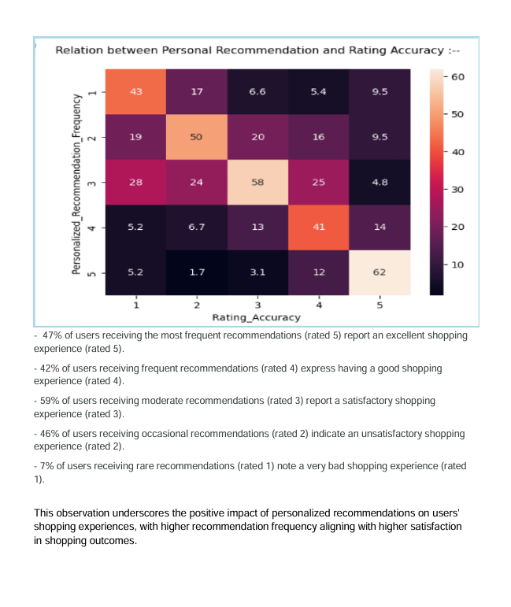
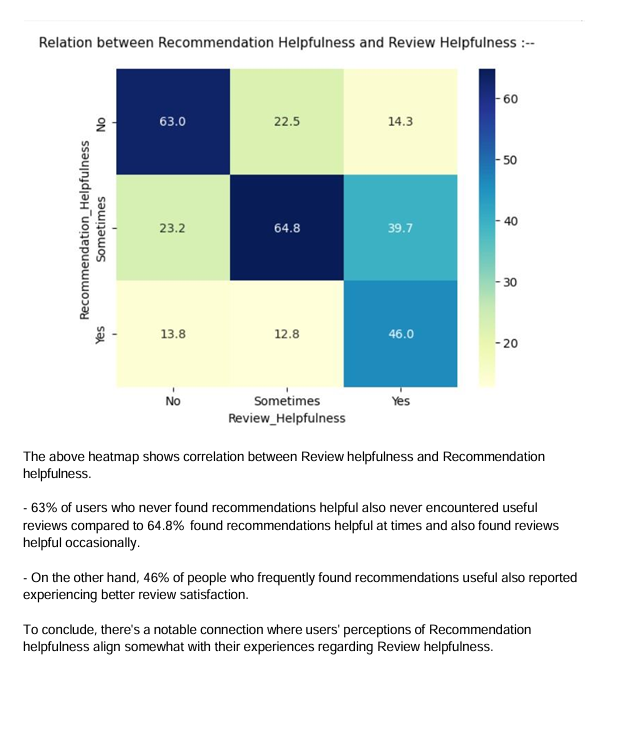
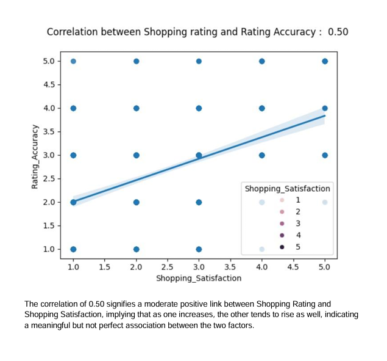
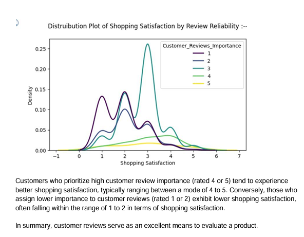

# Amazon Consumer Behavior Analysis

## Project Overview
This project focuses on analyzing Amazon customer behavior patterns using data analytics and machine learning techniques. The study explores customer purchasing behavior, recommendation systems, shopping satisfaction, customer reviews, and demographic trends to understand the factors influencing consumer decision-making in the e-commerce industry.

The analysis was conducted using Python libraries for data cleaning, visualization, statistical analysis, and predictive modeling.

---

## Business Problem
E-commerce companies like Amazon rely heavily on customer behavior insights to improve:
- Product recommendations
- Customer satisfaction
- Marketing strategies
- Retention rates
- Shopping experiences

This project aims to identify the major factors influencing customer purchasing behavior and shopping satisfaction.

---

## Research Question
### What are the key factors influencing Amazon customers' preferences and purchasing behaviors, and how do these factors vary across different demographics?

---

## Dataset Information
- Dataset Size: 602 rows × 23 columns
- Source: Kaggle
- Data Includes:
  - Customer demographics
  - Purchase frequency
  - Shopping satisfaction
  - Product categories
  - Customer reviews
  - Recommendation systems
  - Cart behavior

---

## Technologies & Tools Used

### Programming Language
- Python

### Libraries Used
- Pandas
- NumPy
- Matplotlib
- Seaborn
- Plotly
- Scikit-learn
- Statsmodels
- SciPy

### Machine Learning Models
- Decision Tree Classifier
- Random Forest Classifier
- OLS Regression
- ANOVA Feature Selection

---

## Data Cleaning & Feature Engineering
The project included:
- Handling missing values
- Renaming columns
- Time and date extraction
- Customer age categorization
- Time-based segmentation
- Cart completion preprocessing

Additional features created:
- Age Category
- Time Status (Morning/Afternoon/Evening/Night)

---

## Key Data Analysis & Visualizations

### Customer Demographics
- Female customers represented the majority of the dataset.
- Young adults (18–25) formed the largest customer segment.

### Shopping Behavior
- Most purchases occurred during nighttime.
- Beauty & Personal Care and Clothing categories showed high engagement.

### Customer Reviews
- Customers who valued reviews highly reported better shopping satisfaction.

### Personalized Recommendations
- Higher recommendation frequency strongly correlated with higher shopping satisfaction.

### Shopping Satisfaction
- Rating accuracy and recommendation quality significantly impacted customer satisfaction.

---

## Statistical Analysis

### OLS Regression Findings
The following variables significantly influenced shopping satisfaction:
- Personalized Recommendation Frequency
- Customer Review Importance
- Rating Accuracy

### Model Performance
| Model | Accuracy |
|---|---|
| Decision Tree Classifier | 68% |
| Random Forest Classifier | 74% |

The Random Forest Classifier outperformed the Decision Tree model in:
- Precision
- Recall
- F1-Score
- Overall Accuracy

---

## Business Insights
The analysis suggests that:
- Personalized recommendations improve customer satisfaction.
- Accurate ratings increase purchase confidence.
- Customer reviews play a major role in buying decisions.
- Young adults are the most active customer group.
- Product categories like fashion and beauty have strong customer retention.

---

## Future Improvements
- Analyze non-purchasing customer behavior
- Expand the dataset for long-term trend analysis
- Improve recommendation algorithms
- Perform customer segmentation
- Integrate social media and website analytics

---

## Project Structure

```text
amazon-consumer-behavior-analysis/
│
├── README.md
├── Amazon_Consumer_Project_Report.pdf
├── dataset/
├── notebooks/
├── screenshots/
└── visualizations/
```

---

## Visualizations

### Customer Gender Analysis


---

### Customer Age Distribution


---

### Purchase Category Distribution


---

### Recommendation vs Shopping Satisfaction Heatmap


---

### Recommendation vs Review Helpfulness


---

### Shopping Rating Correlation


---

### Shopping Satisfaction Distribution

---

## Skills Demonstrated
- Data Cleaning
- Exploratory Data Analysis (EDA)
- Data Visualization
- Statistical Analysis
- Machine Learning
- Predictive Modeling
- Business Analytics
- Customer Behavior Analysis

---

## Author
### Raj Verma

Business & Data Analytics Enthusiast

---

## References
- Kaggle Dataset
- Scikit-learn Documentation
- Statsmodels Documentation
- Amazon E-commerce Research
